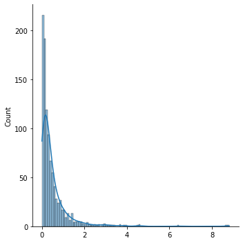

# torchlambertw: Lambert W function and Lambert W x F distributions in pytorch


[](http://makeapullrequest.com)
[](https://lbesson.mit-license.org/)


**IMPORTANT**: This is *NOT* ready for use.  This is just a prototype serving as basis of discussion in https://github.com/pytorch/pytorch/issues/108948. 

This has not been properly tested w/ all pytorch functionality and should not be used other than for prototyping/R&D.

See https://github.com/gmgeorg/torchlambertw/issues for remaining issues/TODOs.

---

# Overview

This library is a native implementation in `pytorch` of

 * the Lambert W function (`special.lambertw`)

 * Lambert W x F distributions (`torch.distributions`)

While this library is for now standalone, the goal is to get both the mathematicla function as well as the distributions into `torch` core package.

See also https://github.com/pytorch/pytorch/issues/108948.


## Installation

It can be installed directly from GitHub using:

```python
pip install git+https://github.com/gmgeorg/torchlambertw.git
```


## Lambert W function (math)

Implementation of the Lambert W function (special function) in `torch`:

```python
import torchlambertw as tw
import numpy as np
special.lambertw(torch.tensor([-1., 0., 1., -np.exp(-1)]))
```
output:
```bash
tensor([nan,  0.0000,  0.5671, -1.0000], dtype=torch.float64)
```

As a more interesting example you can use this implementation to replicate the figure on the [Lambert W Function](https://en.wikipedia.org/wiki/Lambert_W_function) Wikipedia page:

```python
import numpy as np
import matplotlib.pyplot as plt
from torchlambertw import special

def plot_lambertW(range_start, range_end, num_points=2000):
    x_values = np.linspace(range_start, range_end, num_points)
    x_values_torch = torch.tensor(x_values)
    principal_branch_values = special.lambertw(x_values_torch, k=0).numpy()
    non_principal_branch_values = special.lambertw(x_values_torch, k=-1).numpy()
    
    plt.figure(figsize=(8, 5))
    plt.plot(x_values, principal_branch_values, label="Principal Branch", color='blue')
    plt.plot(x_values, non_principal_branch_values, label="Non-Principal Branch", color='red')
    
    plt.title("Lambert W Function")
    plt.xlabel("x")
    plt.ylabel("W(x)")
    plt.xlim(range_start, range_end)
    plt.ylim(-4, 2)  # same range as wiki figure
    plt.axhline(0, color='black', linestyle='--', linewidth=0.5)
    plt.axvline(0, color='black', linestyle='--', linewidth=0.5)
    plt.legend()
    
    plt.grid(True)
    plt.show()

# Example usage:
plot_lambertW(-1, 6)

```


## Lambert W x F distributions

For the original papers see Goerg 2011 & 2015. If you want to jump into applications and examples I suggest looking at the [**LambertW** R package](https://github.com/gmgeorg/LambertW) for detailed references and links to many external examples on Stackoverflow / cross-validated and other external blogs.


### Heavy-tail distributions first
```python
from torchlambertw import distributions as tlwd

# Implements a Lambert W x Normal distribution with (loc=1, scale=3, tailweight=0.75)
m = tlwd.LambertWNormal(loc=torch.tensor([1.0]), 
                        scale=torch.tensor([3.0]), 
                        tailweight=torch.tensor([0.75]))
m.sample((2,)) 
```
```
tensor([[ 0.0159], [-0.9322]])
```

This distribution is quite heavy-tailed with moments existing only up to `1 / tailweight = 1.33`, ie this random variable / distribution has no variance.

```python
m.tailweight, m.support, m.mean, m.variance
```
```
(tensor([0.7500]), Real(), tensor([1.]), tensor([inf]))
```

Let's draw a random sample from distribution and plot density / ecdfplot.

```python
torch.manual_seed(0)
# Use a less heavy-tailed distribution with a tail parameter of 0.25 (ie moments < 1/0.25 = 4 exist).
m = tlwd.LambertWNormal(loc=torch.tensor([1.0]), scale=torch.tensor([3.0]), 
                        tailweight=torch.tensor([0.25]))
y = m.sample((1000,)).numpy().ravel()

import seaborn as sns
import statsmodels.api as sm

sns.displot(y, kde=True)
plt.show()
sm.qqplot(y, line='45', fit=True)
plt.grid()
plt.show()
```


#### Back-transformation

TODO: allow to estimate parameters from samples using MLE or Bayesian inference (see https://github.com/gmgeorg/torchlambertw/issues/1).

The parameters `(loc, scale, tailweight)` can be estimated from the data (see **LambertW** R package or also the `gaussianize` package for an **sklearn** wrapper).

Let's assume you have the parameters estimated (perfectly); then you can use this to obtain the unobserved, Gaussian data:

```python
torch.manual_seed(0)

m = tlwd.LambertWNormal(loc=torch.tensor([1.0]), scale=torch.tensor([3.0]), 
                        tailweight=torch.tensor([0.25]))

y = m.sample((1000,)).numpy().ravel()
x = m.transforms[0]._inverse(torch.tensor(y)).numpy().ravel()
sns.displot(x, kde=True)
plt.show()
sm.qqplot(x, line='45', fit=True)
plt.grid()
plt.show()

```


### Skewed Lambert W x F distributions

For introducting skewness one can use the skewed Lambert W x F distributions; particularly
interesting are skewed Lambert W x Gaussian distributions as they can be used to transform Normal data to skewed data (and back).

```python
torch.manual_seed(0)
m = tlwd.SkewLambertWNormal(loc=torch.tensor([1.0]), scale=torch.tensor([3.0]), 
                        skewweight=torch.tensor([0.25]))
y = m.sample((1000,)).numpy().ravel()


sns.displot(y, kde=True)
plt.show()
sm.qqplot(y, line='45', fit=True)
plt.grid()
plt.show()
```


#### Skewed Lambert W x Exponential distributions

Lambert W x F distribution can be generated for any arbitratry F.  Here we show an example of a skewed Lambert W x Exponential distribution. For `skewweight > 0` , this will be more (right) skewed than a baseline exponential distribution. 

See Goerg (2011) and Kaarik et al. (2023).
```python
torch.manual_seed(0)
m = tlwd.SkewLambertWExponential(rate=torch.tensor([3.0]), 
                                 skewweight=torch.tensor([0.2]))
y = m.sample((1000,)).numpy().ravel()
print("mean: theoretical %f; empirical: %f" % (m.mean.numpy()[0], np.mean(x)))

sns.displot(y, kde=True)
plt.show()
sm.qqplot(y, line='45', fit=True, dist=stats.expon)
plt.grid()
plt.show()

```

Mean is larger than the 1/3. rate of the baseline exponential distribution because of the longer tail.
```
mean: theoretical 0.520833; empirical: 0.481116
```




## Implementation details

This implementation closely follows the TensorFlow Probability version in [`tfp.special.lambertw`](https://www.tensorflow.org/probability/api_docs/python/tfp/math/lambertw).


See also [here](https://github.com/thibsej/unbalanced-ot-functionals/blob/13f2203b3993d973f929578085ea458c5c1a7a78/common/torch_lambertw.py) and [here](
https://github.com/AminJun/BreakingCertifiableDefenses/blob/cc469fa48f7efba21f3584e233c4db0c9a4856c1/RandomizedSmoothing/projected_sinkhorn/lambertw.py
)) for minimum example `pytorch` implementations.


# Installation

It can be installed directly from GitHub using:

```python
pip install git+https://github.com/gmgeorg/torchlambertw.git
```


## References

* Corless, R.M., et al. (1996) On the LambertW Function. Advances in Computational Mathematics, 5, 329-359.
https://doi.org/10.1007/BF02124750 

* Lambert W implementation in TensorFlow: https://www.tensorflow.org/probability/api_docs/python/tfp/math/lambertw

* Goerg (2011). *Lambert W random variables—a new family of generalized skewed distributions with applications to risk estimation.* Ann. Appl. Stat. 5 (3) 2197 - 2230, 2011. https://doi.org/10.1214/11-AOAS457 

* Goerg (2015) *The Lambert Way to Gaussianize Heavy-Tailed Data with the Inverse of Tukey’s h Transformation as a Special Case*. The Scientific World Journal. Volume 2015 | Article ID 909231 | https://doi.org/10.1155/2015/909231

* Käärik, Meelis & Selart, Anne & Puhkim, Tuuli & Tee, Liivika. (2023). *Lambert W random variables and their applications in loss modelling*. https://arxiv.org/pdf/2307.05644.pdf

# License

This project is licensed under the terms of the [MIT license](LICENSE).
